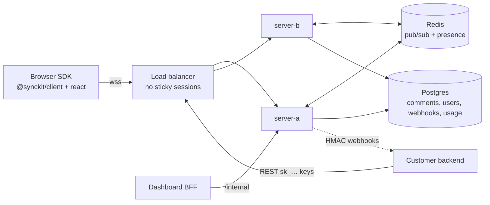

# SyncKit — Acquisition One-Pager

**Embeddable realtime collaboration infrastructure**: presence & live
cursors, threaded comments, notifications and custom broadcasts, delivered
as SDKs + a multi-tenant backend. The same category as Cord (acquired),
Liveblocks and Pusher — built to be dropped into an existing SaaS product
in hours.

## What the buyer gets

| Asset              | State                                                                                                              |
| ------------------ | ------------------------------------------------------------------------------------------------------------------ |
| Protocol & backend | Fastify WS gateway + REST, Redis fan-out, Postgres persistence; multi-instance, no sticky sessions                 |
| `@synckit/client`  | 3.7 kB gzip vanilla SDK — reconnect w/ jitter, token refresh, offline buffer, gap-resync                           |
| `@synckit/react`   | Hooks + 5 themeable components (cursors, avatars, threads, pins, inbox), Storybook                                 |
| Customer dashboard | Next.js: auth, orgs/invites, projects, API keys, webhooks, live usage, billing                                     |
| Billing            | Stripe subscriptions + metered MAU overage, plan enforcement at the socket and API                                 |
| Ops                | Dockerfiles (distroless), compose stack, LB config, Prometheus `/metrics`, Grafana dashboard, chaos suite, runbook |
| Docs & demo        | Nextra docs site, typedoc SDK reference, collaborative kanban demo (`?user=alice\|bob`)                            |
| Quality gates      | 139 integration-first tests against real Postgres/Redis, Playwright e2e, CodeQL, `pnpm audit` clean, CI green      |

## Architecture (60 seconds)

Rooms are namespaced per project; per-room sequence numbers give clients
deterministic gap detection and automatic resync. Presence lives in Redis
with TTL (evaporates on crash); only durable data touches Postgres.

## Measured numbers (not marketing)

From `load/RESULTS.md`, run on 4 vCPU with generators co-located
(conservative):

- REST comments: **199.3 rps sustained, p95 = 23 ms** (target < 100 ms), 0 errors in 11 960 requests
- Presence fan-out: **p95 = 1–2 ms** end-to-end at 500–1 000 concurrent connections across 2 instances (4.5 M samples, 0 drops)
- Saturation behavior verified at ~156 k msg/s demanded fan-out: no message loss, no dropped connections, instant recovery
- Chaos-tested: Redis SIGKILL → fan-out auto-recovers; Postgres outage → REST degrades to 503 + `Retry-After` while WS keeps running; instance replacement → SDK reconnects in **< 5 s** with presence intact
- Client SDK: **3.69 kB gzip** (budget 15 kB, enforced in the build)

## Unit economics (COGS)

A 4 vCPU / 8 GB node (≈ €25/mo at Hetzner) held 1 000 active connections at
p95 = 2 ms with the _load generators on the same box_ — i.e. ≥ 1 000
conns/node is a floor, not a ceiling. With 2× app nodes + managed
Postgres/Redis (≈ €110/mo total floor):

- **≈ €0.05–0.11 / 1 000 connection-hours** at fleet utilization
- Pro plan (€49/mo, 100 concurrent) carries an infra cost of single-digit
  euros → **~90 %+ gross margin** at modest density; Scale (€299/mo) rides
  the same fleet.

## Competitive line-up

|                           | SyncKit             | Liveblocks | Cord     | Pusher          |
| ------------------------- | ------------------- | ---------- | -------- | --------------- |
| Presence + cursors        | ✅                  | ✅         | ✅       | DIY on channels |
| Threaded comments + UI    | ✅                  | ✅         | ✅ (was) | ❌              |
| Notifications             | ✅                  | ✅         | ✅       | ❌              |
| Self-hostable             | **✅ (compose up)** | ❌         | ❌       | ❌              |
| Own your auth (JWT mint)  | ✅                  | ✅         | ✅       | ✅              |
| Source available to buyer | **✅ full stack**   | —          | —        | —               |

The self-hosting + full-source angle is the wedge: regulated buyers
(fintech, health) that cannot ship user content to a third-party SaaS.

## Integration time

The demo board (cursors + presence + synced drag&drop + comments +
notifications) is **~400 lines of app code** and was written against the
public SDK surface only. Realistic customer integration: **half a day** for
presence/cursors, **1–2 days** for comments with custom UI. Docs include
10-minute quickstarts for React and vanilla JS.

## Roadmap (post-acquisition leverage)

1. **CRDT document storage** (Yjs-compatible rooms) — upsell into
   collaborative editing; protocol already has seq/resync primitives.
2. **Mobile SDKs** (React Native first — the client is transport-clean,
   no DOM dependencies).
3. **SOC 2 Type II** — logging/redaction, audit trails and access control
   are already in place; the gap is process documentation.
4. Presence-scale work: room sharding above ~10 k members/room, regional
   Redis replication.

## Numbers a buyer should verify

Everything above is reproducible from the repo: `pnpm test` (139 tests),
`node load/prepare.mjs` + harnesses for the latency table,
`docker compose -f docker-compose.prod.yml up` for the full stack, and the
chaos suite for the failover claims.
