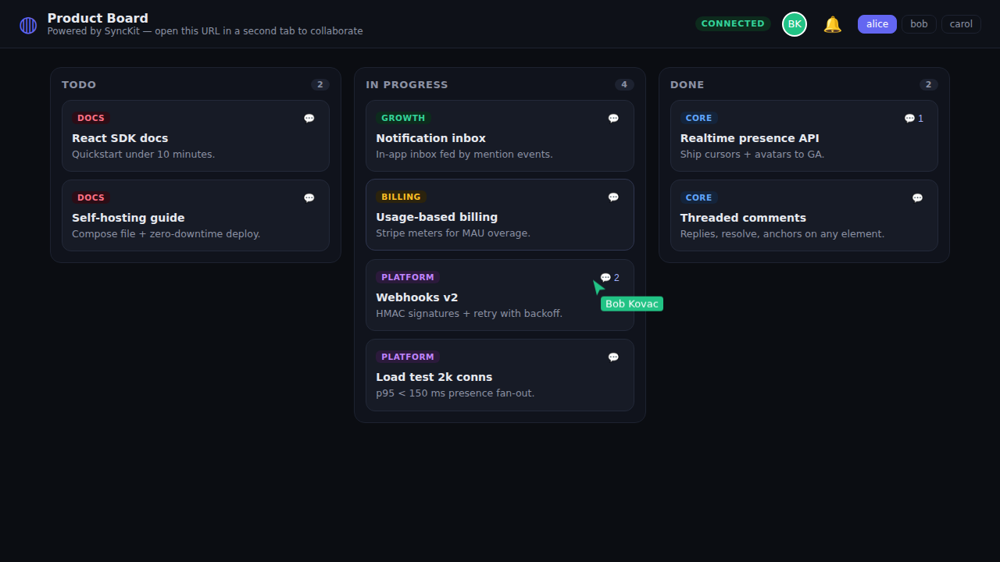

<div align="center">

# ◍ SyncKit

**Realtime collaboration infrastructure you can embed in an afternoon.**

Presence & live cursors · threaded comments · notifications · custom broadcasts

[](../.github/workflows/ci.yml)
[](#quality)
[](packages/client)
[](PITCH.md)



_The demo board: two users, live cursors, synced drag & drop, comments and
notifications — ~400 lines of app code. Run it with `pnpm dev` and open
`?user=alice` and `?user=bob` in two tabs._

</div>

## What it looks like

```tsx
const client = createClient({
  url: "wss://api.your-synckit.com/v1/realtime",
  tokenProvider: () => fetch("/api/synckit-token").then((r) => r.json().then((b) => b.token)),
});

<SyncKitProvider client={client}>
  <RoomProvider id="document-42" initialPresence={{ cursor: null }}>
    <LiveCursors />
    <PresenceAvatars />
    <CommentsThread anchor={{ blockId: "intro" }} />
  </RoomProvider>
</SyncKitProvider>;
```

## Why it holds up

- **Multi-instance by design** — Redis pub/sub fan-out, per-room sequence
  numbers with automatic client resync, no sticky sessions. Chaos-tested:
  kill Redis, kill Postgres, kill an instance — clients recover on their
  own (see `apps/server/src/chaos/`).
- **Your auth stays yours** — your backend exchanges its API key for
  short-lived HS256 JWTs; SyncKit never sees your user database.
- **Measured, not promised** — REST p95 23 ms @ 200 rps; presence fan-out
  p95 1–2 ms @ 1 000 connections ([load/RESULTS.md](load/RESULTS.md)).
- **Operable** — Prometheus `/metrics` + Grafana dashboard
  ([infra/grafana](infra/grafana)), structured logs with secret redaction,
  `/healthz`, documented runbook ([DEPLOY.md](DEPLOY.md)).
- **Complete product** — customer dashboard (orgs, projects, API keys,
  webhooks, usage), Stripe billing with metered MAU overage and plan
  enforcement, HMAC-signed webhooks with SSRF guard and retries.

## Repository layout

```
apps/
  server/       Fastify: WebSocket gateway + REST API + billing + webhooks
  dashboard/    Next.js customer dashboard (BFF over /internal)
  demo/         Collaborative product board (the screenshot above)
  docs/         Nextra documentation site (+ typedoc SDK reference)
packages/
  core/         Wire protocol (zod schemas), plans, shared types
  client/       @synckit/client — vanilla SDK, 3.7 kB gzip
  react/        @synckit/react — hooks + themeable components
load/           k6 scenarios + zero-dep Node load harness + measured results
infra/          nginx LB config, Grafana dashboard JSON
```

## Getting started

Prerequisites: Node.js ≥ 22, pnpm 10, Docker (or local Postgres 16 + Redis 7).

```bash
docker compose up -d      # Postgres + Redis
pnpm install
pnpm db:migrate && pnpm db:seed   # seed prints a dev API key once
pnpm dev                  # server :4000 · dashboard :3000 · demo :5173 · docs :3002
```

Health check: `curl localhost:4000/healthz` → `{"status":"ok","db":"ok","redis":"ok"}`.
OpenAPI: `localhost:4000/v1/openapi.json`. New-machine diagnosis:
`node scripts/doctor.mjs`.

Production: `cp .env.prod.example .env` →
`docker compose -f docker-compose.prod.yml up --build` (2× API behind
nginx, dashboard, demo). Full runbook in [DEPLOY.md](DEPLOY.md).

## Quality

`pnpm format:check && pnpm lint && pnpm typecheck && pnpm build && pnpm test`
is the CI gate. 139 tests run against **real** Postgres and Redis (no DB
mocks): protocol, realtime engine (churn, backpressure, rate limits,
cross-instance fan-out), REST + auth + webhooks (incl. SSRF cases), billing
(fake Stripe provider), SDK integration (real server child process), React
components, plus Playwright e2e for the dashboard and a chaos suite for
failover. Security posture: [SECURITY.md](SECURITY.md).

## Documents

| File                               | Contents                                                              |
| ---------------------------------- | --------------------------------------------------------------------- |
| [PITCH.md](PITCH.md)               | Acquisition one-pager: architecture, numbers, unit economics, roadmap |
| [DEPLOY.md](DEPLOY.md)             | Hetzner/Fly.io runbook, zero-downtime deploys, backups                |
| [SECURITY.md](SECURITY.md)         | Threat model + OWASP-aligned controls checklist                       |
| [CONTRIBUTING.md](CONTRIBUTING.md) | Dev workflow, error-envelope contract, changesets                     |
| [load/RESULTS.md](load/RESULTS.md) | Honest measured load-test results                                     |
